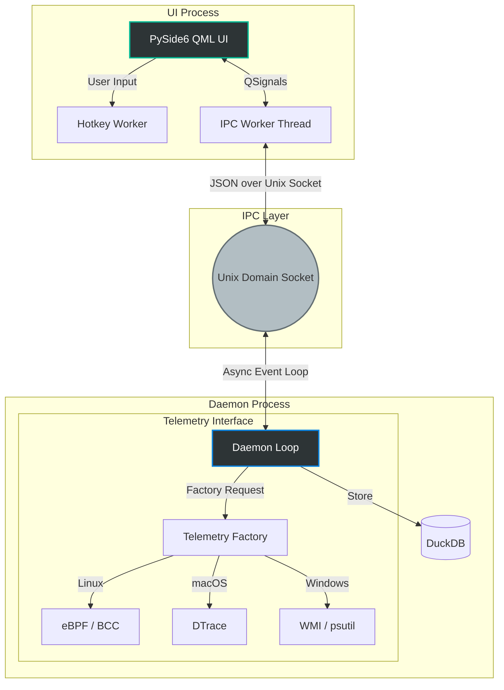

# Synapse ⚡

[](https://www.python.org/downloads/release/python-3120/)
[](https://opensource.org/licenses/MIT)
[](https://github.com/astral-sh/ruff)
[](https://mypy.readthedocs.io/en/stable/)
[](https://nuitka.net/)

> A cross-platform, extreme-performance Python daemon for local process telemetry.

Synapse is a local-first, zero-overhead performance telemetry application designed specifically for live Python environments. 

---

## ✨ Architectural Highlights

- **Near-Zero Overhead Telemetry**: Implements an OS-aware abstract factory. On Linux, it injects custom C structures into Kernel **eBPF tracepoints** via `bcc-tools` to intercept block I/O without costly context switching. Fallbacks utilize `psutil` (Windows) and `DTrace` (macOS).
- **Sub-50ms Transparent HUD**: The frontend completely bypasses traditional `QtWidgets` overhead. By utilizing `QGuiApplication`, native `QQuickWindow` flags, and explicit **Vulkan GPU offloading**, the UI achieves frameless, click-through transparency at 60+ FPS on Linux X11/Wayland.
- **Asynchronous IPC**: The PySide6 UI and the background daemon run in entirely separate processes. They communicate via a strictly non-blocking Unix Domain Socket (`asyncio`), ensuring UI responsiveness regardless of backend load.
- **Embedded Analytical Datastore**: Leverages **DuckDB** for lightning-fast, SQL-driven telemetry aggregation and historical time-series analytics within the daemon.
- **AOT Native Compilation**: Distributed not as a Python script, but as a heavily tree-shaken, standalone native C++ executable via **Nuitka**.

---

## 🏗️ System Architecture



## 📂 Domain Structure

```text
src/
├── ui/            # PySide6 HUD, CLI overlays, and Global Hotkey managers
├── daemon/        # Background daemon and asyncio event loop orchestration
├── telemetry/     # Abstracted OS telemetry instrumentation (eBPF, WMI, DTrace)
├── ipc/           # Decoupled Unix socket servers and clients
└── domain/        # DuckDB datastores and immutable domain data models
```

---

## 🚀 Getting Started

### Prerequisites

- **Python 3.12+**
- **[uv](https://github.com/astral-sh/uv)** (Extremely fast Python package installer and resolver)

### Local Development Setup

1. **Clone & Initialize**
   ```bash
   git clone https://github.com/tuboa2/synapse.git
   cd synapse
   uv venv
   source .venv/bin/activate
   ```

2. **Install Dependencies**
   ```bash
   uv sync
   ```

3. **Code Quality & Validation**
   Synapse enforces rigorous CI/CD constraints locally:
   ```bash
   uv run ruff check src     # Linting
   uv run ruff format src    # Formatting
   uv run mypy src           # Strict Static Type Checking
   ```

---

## 🔨 AOT Compilation (Nuitka)

To showcase extreme technical optimization, Synapse abandons standard Python distribution in favor of an **Ahead-Of-Time (AOT) C++ compilation pipeline**. 

This strips the Python interpreter and unused standard libraries entirely, producing a lean, standalone native binary.

1. Review the defensive compilation script:
   ```bash
   cat build_nuitka.sh
   ```
2. Execute the build pipeline:
   ```bash
   ./build_nuitka.sh
   ```
3. Locate your compiled binary in the `dist/` directory.

---

## 📜 License

This project is licensed under the MIT License - see the LICENSE file for details. Built strictly as a technical portfolio demonstration.
